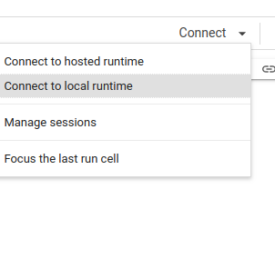
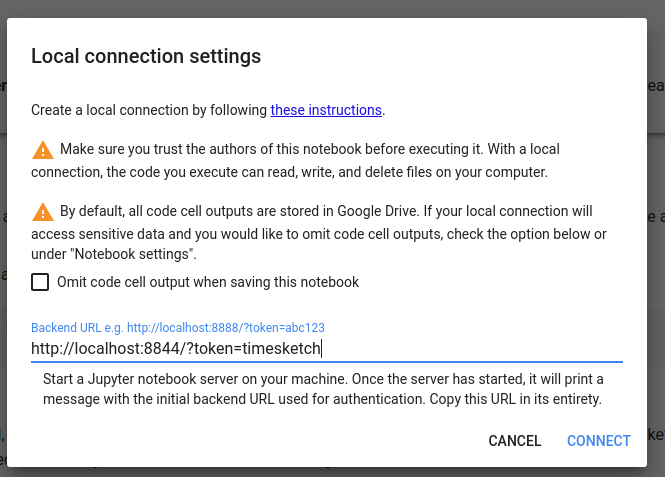
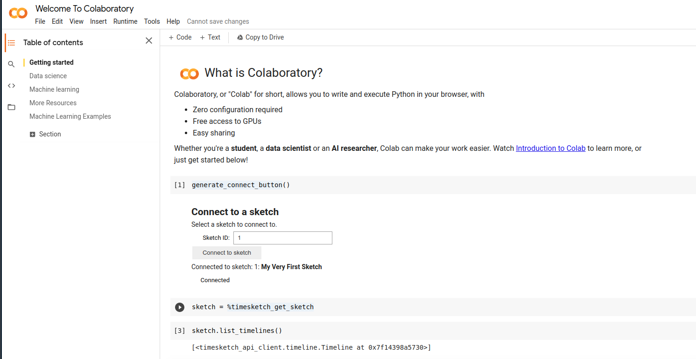
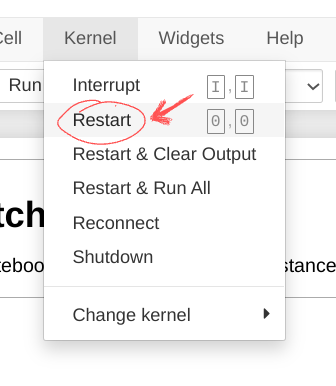

### Developers guide

It is recommended to develop Timesketch using a docker container. Refer to [Docker Readme](../docker/dev/README.md) for details on how to bring up the development container.

Note: Exclamation mark `!` denotes commands that should run in the docker container shell, dollar sign `$` denotes commands to run in your local shell.

#### Frontend development

First we need to get an interactive shell to the container to install the frontend modules:
```
$ docker exec -it $CONTAINER_ID bash
```
Then inside the container shell go to the Timesketch frontend directory. 
```
! cd /usr/local/src/timesketch/timesketch/frontend
```
Note that this directory in the container is mounted as volume from your local repo and mirrors changes to your local repo.

Install node dependencies
```
! npm install
```
This will create `node_modules/` folder from `package.json` in the frontend directory.
```
! yarn install
```

#### Running tests and linters

The main entry point is `run_tests.py` in Timesketch root. Please note that for testing 
and linting python/frontend code in your local environment you need respectively python/
frontend dependencies installed.

For more information:
```
! run_tests.py --help
```
To run frontend tests in watch mode, cd to `frontend` directory and use
```
! yarn run test --watch
```
To run TSLint in watch mode, use
```
! yarn run lint --watch
```

To run a single test (there are multiple ways to do it), open a shell in the docker container:
```
docker exec -it $CONTAINER_ID /bin/bash
```
Switch to:
```
cd /usr/local/src/timesketch
```
And execute the single test
```
nosetests timesketch/lib/emojis_test.py -v
```

#### Building Timesketch frontend

To build frontend files and put bundles in `timesketch/static/dist/`, use
```
! yarn run build
```
To watch for changes in code and rebuild automatically, use
```
! yarn run build --watch
```
This is what you would normally use when making changes to the frontend.
Changes are not instantaneous, it takes a couple of seconds to rebuild. It's best to
keep this interactive shell to your container running so you can monitor the re-build.

Don't forget to refresh page if your browser doesn't automatically load the changes.

#### Packaging

Before pushing package to PyPI, make sure you build the frontend before.

#### Local development

You may work on the frontend for your local environment for integration with your IDE or other reasons. This is not recommended however as it may cause clashes with your installed NodeJS.

Add Node.js 8.x repo
```
$ curl -sS https://deb.nodesource.com/gpgkey/nodesource.gpg.key | sudo apt-key add -
$ echo "deb https://deb.nodesource.com/node_8.x $(lsb_release -s -c) main"  | sudo tee /etc/apt/sources.list.d/nodesource.list
```
Add Yarn repo
```
$ curl -sS https://dl.yarnpkg.com/debian/pubkey.gpg | sudo apt-key add -
$ echo "deb https://dl.yarnpkg.com/debian/ stable main" | sudo tee /etc/apt/sources.list.d/yarn.list
```
Install Node.js and Yarn
```
$ apt-get update && apt-get install nodejs yarn
```
After that you would run the same steps as with docker container to install frontend 
dependencies and build/test.


#### Using Notebook

The development container contains a jupyter notebook environment to expirement
with the developer instance.

To access the notebook access it in a browser using the URL:
http://localhost:8844/?token=timesketch

(you can also just access http://localhost:8844 and type in `timesketch` as the
password).

To get you started there are snippets you can use (look for the `snippets`
drop-down menu and select the code snippet you want to test.

To be able to use the notebook container using
[colab](https://colab.research.google.com) start by creating a notebook and then
click the little triangle/arrow button in the upper right corner to connect to a
local runtime, see:



This will create a pop-up that you need to enter the URL for the local runtime.
Use: http://localhost:8844/?token=timesketch as the URL.



This will connect to the notebook container, where you can start executing code.



*There are some things that work better in the Jupyter container though.*

##### Developing the API Client Using the Notebook

Using the notebook can be very helpful when developing the API client. New features
can be easily tested.

In order to load changes made in the code, two things need to happen:

1. The code needs to be accessible from the container
2. The code needs to be installed and the kernel restarted

For the code to be accessible, it has to be readable by the user with the UID of 1000 or GID
of 1000. One way of making sure is to run

```shell
$ sudo chgrp -R 1000 timesketch
```

Against the source folder. Then inside a notebook to run:

```python
!pip install /usr/local/src/timesketch/api_client/python
```

After the code is installed the kernel needs to restarted to make the changes take
effect. In the menu select `Kernel | Restart`, now you should be able to go back
into the notebook and make use of the latest changes in the API client.


