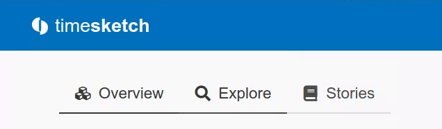
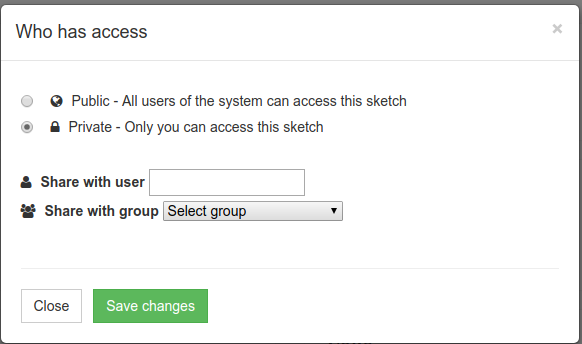
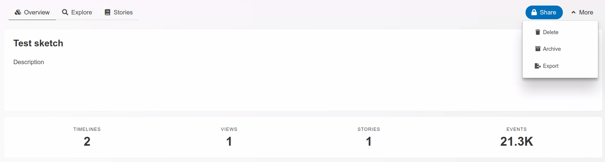

# Sketches

Sketches are a way to organise analysis of events across multiple timelines and increase data discoverability via search, targeted views, comments and stories. 

## Creating a sketch
To create a new sketch, click “New Sketch” button on the tool’s homepage. After that you will be redirected straight onto Overview page of your new sketch. Here you can click “Edit” icon to give your sketch a name and enter a description.

Now you need to add timelines to your new sketch. To do so, you can click “Import Timeline” and upload a file in Plaso, CSV or JSONL formats. More details about importing timelines are in chapter “Importing timelines”

Alternatively, you can go to “Timelines” tab and select from all available timelines.

## Navigating a sketch
A sketch consists of 5 tabs: “Overview”, “Explore”, “Stories”

**Overview** tab contains summary information about your sketch, such as sketch title, description, as well as shortcuts to saved views and timelines.

**Explore** page allows navigating timelines, using search queries, applying filters, viewing timeline data in chart format and saving your search discoveries as new views.

**Stories** tab allows creating outlines of your Stories can be annotated with selected items from your timelines

## Sharing and access control
After the sketch is created, you can share it with other users in the system. To do so, click  button. You will be presented with the following dialogue:

 

You can share the sketch with users, groups of users, make it available to all users in your system, or leave private.

## Explore

**Search** See [SearchQueryGuide](SearchQueryGuide.md)

**Views** allows quick access to saved views and creation of new views

**Timerange** allows to control the timerange of shown events.

**Filter** Add a filter, e.g. to show only starred events

## More

If you click on the "More" Button in the Sketch Overview, you get the following three options.

 

### Delete

Delete the whole sketch. *Note:* this will not delete the Timelines.

### Archive

Archive the whole sketch.

### Export

Export will export the following items:

- events (starred, tagged, tagged_event_stats, comments, ...)
- stories as html
- views (as csv)
