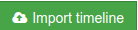

 Timelines

Timelines are the main component of your sketch. One sketch can include multiple timeline, and allows simultaneous navigation over all the timelines of the same sketch.

When starting a new sketch, you will already have your "Timelines" tab populated will all timelines that you can access. To start adding a new timeline, click  

button on "Overview" tab, or use "Import timeline" option on "Timelines" tab.

## Importing timelines

(partially taken from existing guide)

You can import from Plaso, CSV or JSONL formats. 

### From Plaso

To be able to add timelines directly from Plaso, you need to run version >= 1.5.0 Plaso on your Timesketch server. See the [official Plaso documentation](https://github.com/log2timeline/plaso/wiki/Ubuntu-Packaged-Release) for installing Plaso and it's dependencies.

### From CSV or JSONL file

## Navigating timelines

**Explore **tab allows you navigating your timelines, create custom views and use full text search options.

### Viewing a single event

Single event view includes all the fields from the original import file. There is an option to add a comment to an event for further reference.

### Filters and charts

