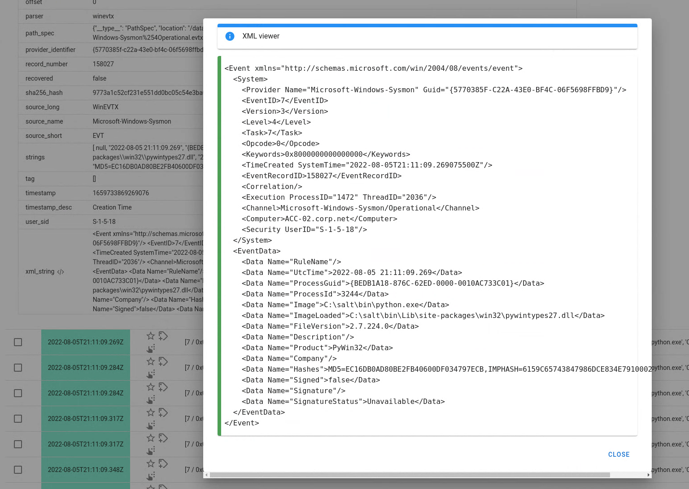
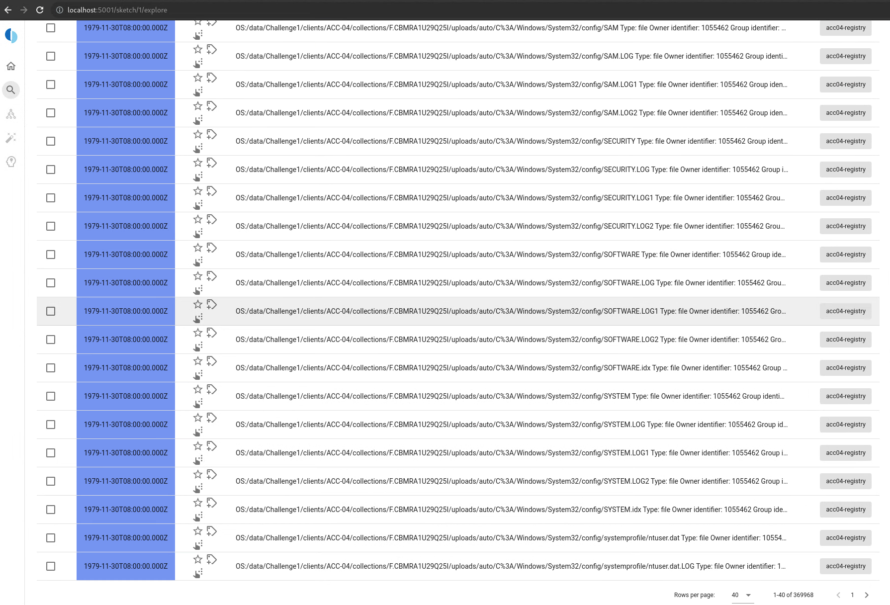
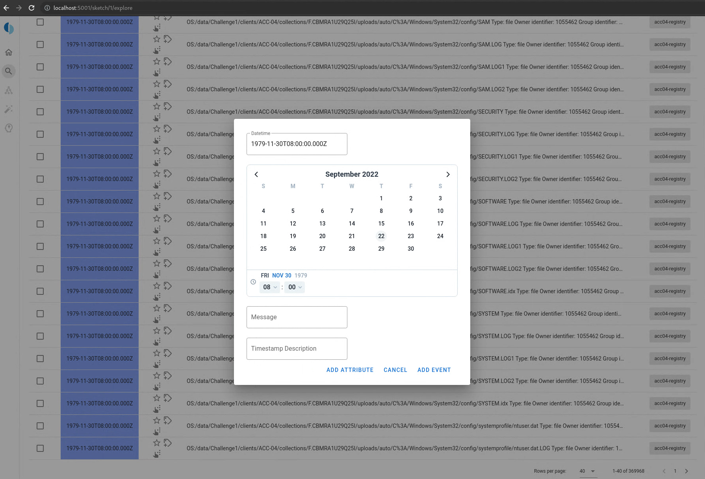
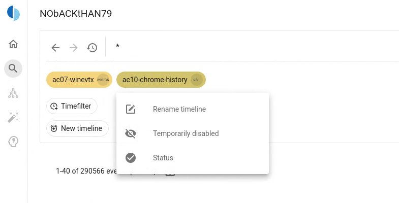
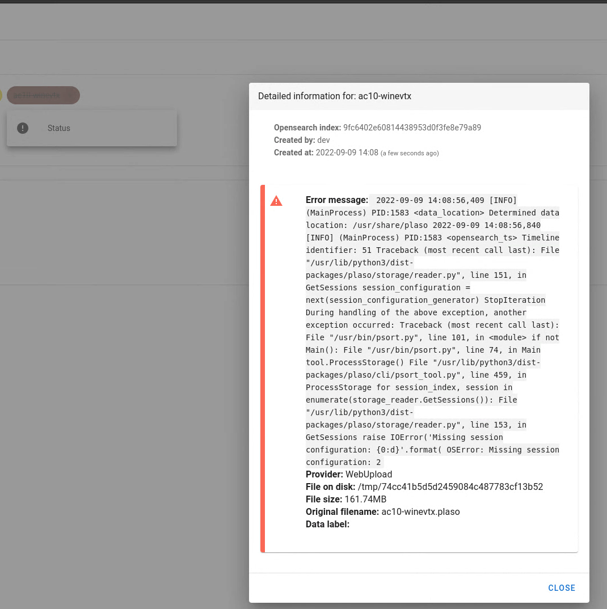
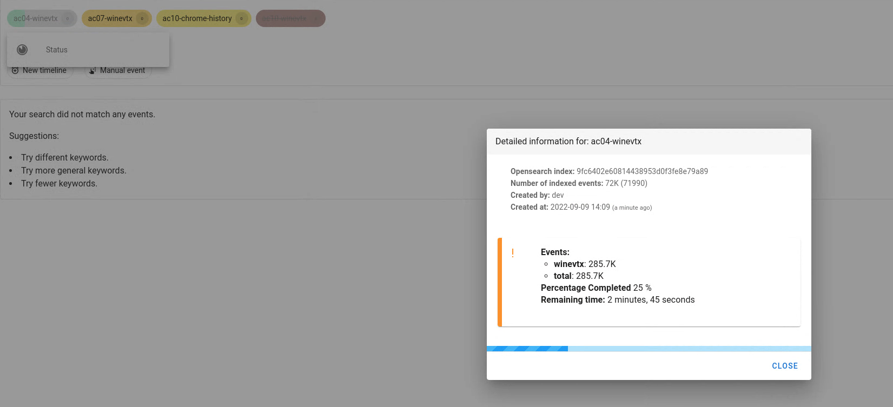

---
hide:
  - footer
---
# 2022-09

## [XML Viewer for xml_string attribute](https://github.com/google/timesketch/pull/2327)

Plaso can parse WINEVTX logs. It creates an attribute xml_string that is the
"dump" of the log itself. The next figure shows how it is represented in
Timesketch.

This valuable information might be hard to interpret since it is written in
a compat format. With this PR we aim to create an icon to visualize better
this attribute.

## [Python Notebook to debug the most common Timesketch API](https://github.com/google/timesketch/pull/2348)

A new [Notebook](https://github.com/google/timesketch/blob/main/notebooks/debugging_timesketch.ipynb)
was added with common Timesketch API interactions such as:

- Timeline information
- create a new sketches
- run an analyzer
- retrieve analyzer results

## [Add manual event in frontend-ng](https://github.com/google/timesketch/pull/2321)

Creating a new manual event correlated to an existing timeline event at the bottom of the page.

## [File upload in frontent-ng](https://github.com/google/timesketch/pull/2322)

Non fully indexed files are constantly monitored to give the user an idea
of the "indexing-progress".

This feature allows the user to upload a large file (e.g., a large Plaso file)
and having an idea about the status of the file on the server
(e.g., 40% indexed).

Add a status dialog that summarize the information of the file
(how many events, the status, i.e., ready, processing, or fail).

The user can directly add a new timeline from the Explore tab.
The user can only enable the timelines that have been successfully uploaded.

Timeline is **ready**: the user can explore it:

Timeline is **failed**: the user can not explore it.
A failed timeline can be spotted because it has a red
background color and it cannot be opened.

Timeline is **processing**: the user can check how many events have already
been indexed and the remaining time for the timeline to be ready.
A "processing" timeline can be spotted because is not fully colored
and it cannot be opened.

### [Sigma support in API client](https://github.com/google/timesketch/pull/2333)

- Change the expected storage from Sigma rules from file system to database
- Update the JS API client to add recent additions of the File based API
- replace the term `es_query` with `query_string` to be consistent with
- the rest of the codebase
- make API client methods deprecated that will soon be gone away as they link
to the file based API
- add methods in the API client that talk to the databased Sigma Rule API

### [Extend datasource model schema](https://github.com/google/timesketch/pull/2342)

- Introduced a new field to the datasource model.
- This PR adds the needed DB migration scripts.

### [Extend Search Templates model to support user defined parameters](https://github.com/google/timesketch/pull/2349)

- Extend Search Templates model to support user defined parameters.
- This PR extend the model to include template_uuid and template_json to support importing of templates, and support for user defined input parameters.

## Bugfixes

### [Uploads not working with newest Plaso](https://github.com/google/timesketch/pull/2300)

When trying to upload a plaso file, the upload failed with psort.py: `error: unrecognized arguments: --elastic_user opensearch --elastic_password opensearch`

### [Search history tree generation](https://github.com/google/timesketch/pull/2320)

The History tree used a naive approach to find a reasonable root node to
generate the tree from. In some edge cases, the last node was not present
in the tree and the UI failed to render the history.

Now it always starts from the last node, and then traverse backwards in the
tree 10 nodes. After that generate the full sub tree with all children etc.

### [docs: Fix a few typos](https://github.com/google/timesketch/pull/2330)

Some typos in documentation have been fixed

### [add vsvode and notebook checkpoints to .gitignore](https://github.com/google/timesketch/pull/2332)

New additions to the `.gitignore` file to make it more usable.

### [fix for Export Sketch feature](https://github.com/google/timesketch/pull/2316)

Fixed an HTTP Error 500 when attempting to export a Sketch.

### And some other minor bugfixes
