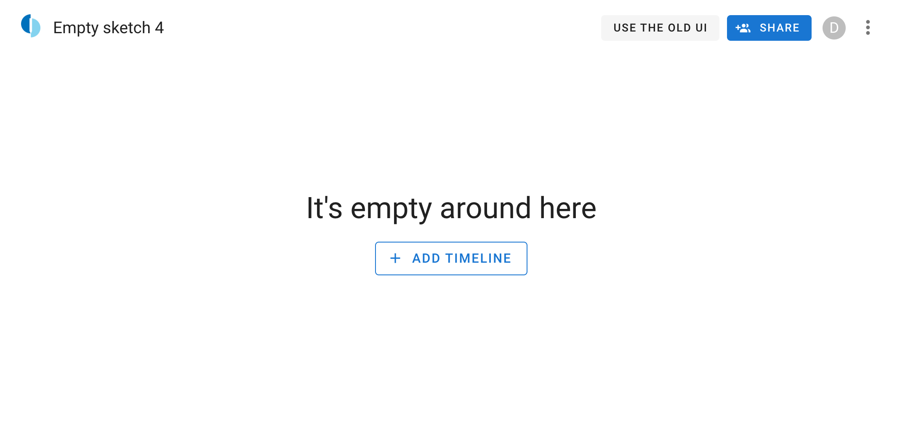

---
hide:
  - footer
---
# 2023-01

## Analyzer tsctl module

New module in tsctl to troubleshoot analyzer runs `tsctl analyzer-stats`.
* filter on analyzer name
* select a focus out of `[many_hits, long_runtime, recent]`
* search for a given text in the analyzer results. This comes handy when searching for a Sigma Rule Id.
* filter results on timeline id

Visit [../guides/admin/admin-cli/](Admin CLI) for more information

## Edit timefilter (#2510)

This PR port over the edit timefilter functionality in the new Frontend.

## Indicator when sketch is loading (#2517)

This PR added a horizontal loading indicator when the sketch is loading. This enhances the experience on slower links etc.

## Add LinkedIn search queries (#2514)

Adds a regex to search for Searches executed on Linkedin

# Empty state (#2501)

Empty state for a newly created sketch where there are no timelines added yet.

## Add share dialog (#2471)

Sharing dialog ported to the new UI. It supports adding users and groups, as well as setting the general access mode for the sketch.

## Enable bulk edit (#2497)

Bulk edit functionality with support for toggle star.

## Bugfixes

Several smaller bugfixes.

