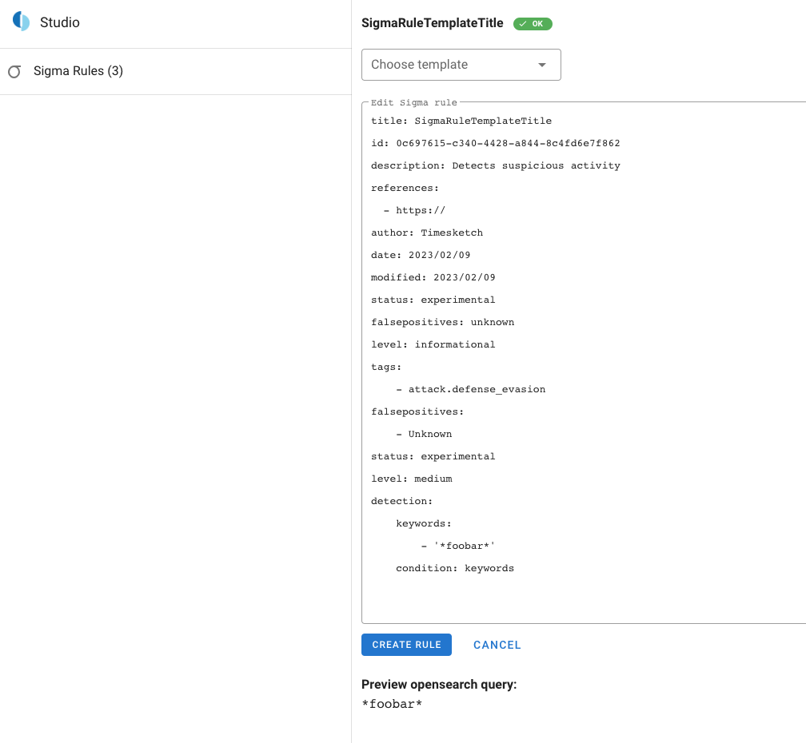
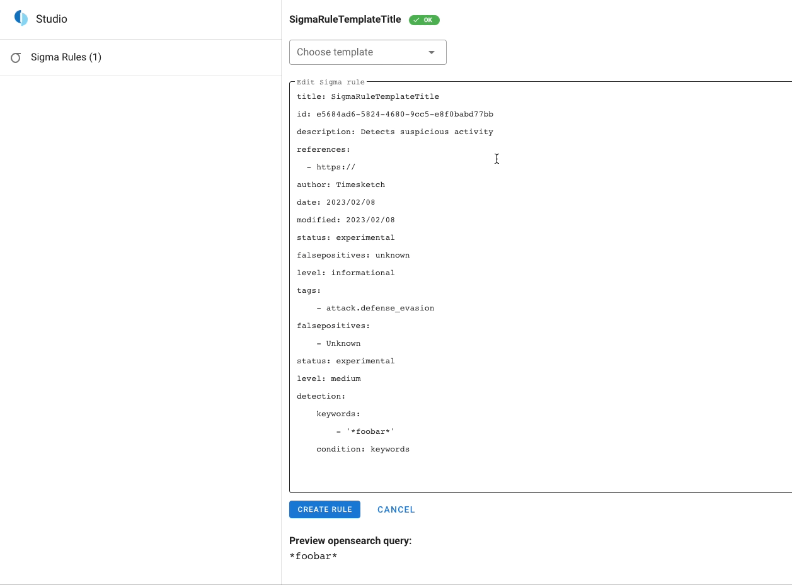
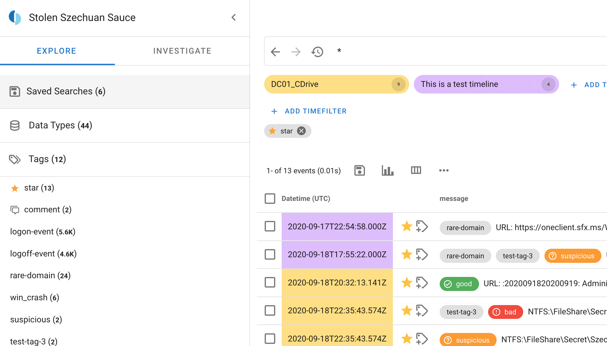

---
hide:
  - footer
---
# 2023-02


## Deprecate File based Sigma rules (#2509)

File based Sigma rules are removed from the codebase. This includes:

* API
* API Client
* JS API client
* Frontend

## make Sigma util tests into dedicated test cases (#2539)

Improvement how tests are handled for Sigma utils.

## Updates to the timesketch.org docs (#2529)

Several updates to the public Documentation

## SigmaStudio (#2444)

New Studio in Timesketch. First functionality is to edit Sigma rules.






## Removable chips (#2519)

Ability to remove filter chips



## Enhance tsctl list-sigma-rules

Now you can specify the attributes that you want to have printed for the rules. This can be useful for things like this.

```bash
tsctl list-sigma-rules --columns=rule_uuid,title,status
rule_uuid,title,status
['8c10509b-9ba5-4387-bf6c-e347931b646f', 'SigmaRuleTemplateTitledddd', 'experimental']
['5266a592-b793-11ea-b3de-0242ac130004', 'Suspicious Installation of Zenmap', 'experimental']
['e5684ad6-5824-4680-9cc5-e8f0babd77bb', 'Foobar', 'experimental']
tsctl list-sigma-rules --columns=rule_uuid,title,status | grep experimental | wc -l
3
```

## Bugfixes

### don't mutate the prop (#2542)

### use a fixed id if crypto.randomUUID is not available (#2537)

In Sigma Rule templates, the code still tried to generate a random UUID, this was causing problems if the connection to Timesketch was not in a HTTPS connection. This is being fixed now.
