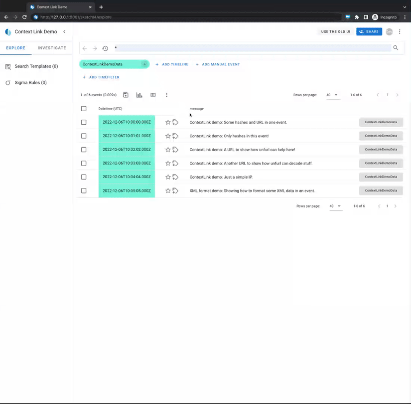

---
hide:
  - footer
---
# Context Links

The context link feature allows for linking of specific event attributes and values to external lookup services for an easy analyst workflow.

## Demo



## How-To configure

The context link feature is configured in a yaml file that needs to be added to the [timesketch.conf](https://github.com/google/timesketch/blob/master/data/timesketch.conf#L325) file. Add the path to the yaml config file in the `CONTEXT_LINKS_CONFIG_PATH` variable.

Per default the `CONTEXT_LINKS_CONFIG_PATH` entry in `timesketch.conf` points to the [context_links.yaml](https://github.com/google/timesketch/blob/master/data/context_links.yaml) file in the `data` folder. It contains a documentation of available fields and a commented example entry for setting up a hash-lookup with [virustotal](https://www.virustotal.com/).

**Important: You can add a context link only for services that allow a lookup via URL GET parameter.**

### Configuration fields

Each context link consists of the following fields:

```
context_link_name:

  short_name:       Type: str | The name for the context link.
                    Will be displayed in the context link submenu.

  match_fields:     Type: list[str] | List of field keys where
                    this context link should be available. Will
                    be checked as case insensitive!

  validation_regex: Type: str | OPTIONAL
                    A regex pattern that needs to be
                    matched by the field value to to make the
                    context link available. This can be used to
                    validate the format of a value (e.g. a hash).

  context_link:     Type: str | The link that will be opened in a
                    new tab when the context link is clicked.
                    IMPORTANT: Add the placeholder "<ATTR_VALUE>"
                    where the attribute value should be inserted
                    into the link.

  redirect_warning: [TRUE]: If the context link is clicked it will
                            open a pop-up dialog first that asks the
                            user if they would like to proceed to
                            the linked page. (Recommended for
                            external pages.)
                    [FALSE]: The linked page will be opened without
                             any pop-up. (Recommended for internal
                             pages.)
```

### Test configuration

If we want to test our configuration we can use the
`tsctl validate-context-links-conf` > [here](https://timesketch.org/guides/admin/admin-cli/#context-links).

## Example entries

Below you can find a list of example entries for popular public lookup services.

**NOTE:** Before running those examples in your environment, verify that the `match_fields` and `validation_regex` work with your data! If you add a field to one of the examples that contain a regex, you need to extend this as well.

### Virustotal

```
virustotal:
  short_name: 'VirusTotal'
  match_fields: ['hash', 'sha256_hash', 'sha256', 'sha1_hash', 'sha1', 'md5_hash', 'md5', 'url']
  validation_regex: '/^[0-9a-f]{64}$|^[0-9a-f]{40}$|^[0-9a-f]{32}$|((([A-Za-z]{3,9}:(?:\/\/)?)(?:[\-;:&=\+\$,\w]+@)?[A-Za-z0-9\.\-]+|(?:www\.|[\-;:&=\+\$,\w]+@)[A-Za-z0-9\.\-]+)((?:\/[\+~%\/\.\w\-_]*)?\??(?:[\-\+=&;%@\.\w_]*)#?(?:[\.\!\/\\\w]*))?)/i'
  context_link: 'https://www.virustotal.com/gui/search/<ATTR_VALUE>'
  redirect_warning: TRUE
```

### Unfurl

```
unfurl:
  short_name: 'unfurl'
  match_fields: ['url', 'uri']
  validation_regex: '/((([A-Za-z]{3,9}:(?:\/\/)?)(?:[\-;:&=\+\$,\w]+@)?[A-Za-z0-9\.\-]+|(?:www\.|[\-;:&=\+\$,\w]+@)[A-Za-z0-9\.\-]+)((?:\/[\+~%\/\.\w\-_]*)?\??(?:[\-\+=&;%@\.\w_]*)#?(?:[\.\!\/\\\w]*))?)/i'
  context_link: 'https://dfir.blog/unfurl/<ATTR_VALUE>'
  redirect_warning: TRUE
```

### Microsoft Event ID lookup

Via the [MS Threat Protection documentation](https://learn.microsoft.com/en-us/windows/security/threat-protection/):

```
mseventid:
  short_name: 'MS-TP eventID'
  match_fields: ['event_identifier']
  context_link: 'https://learn.microsoft.com/en-us/windows/security/threat-protection/auditing/event-<ATTR_VALUE>'
  redirect_warning: TRUE
```

Via [Ultimate Windows Security](https://www.ultimatewindowssecurity.com/securitylog/):

```
uws-eventid:
  short_name: 'UWS eventID'
  match_fields: ['event_identifier']
  context_link: 'https://www.ultimatewindowssecurity.com/securitylog/encyclopedia/event.aspx?eventID=<ATTR_VALUE>'
  redirect_warning: TRUE
```

### urlscan.io

```
urlscanio:
  short_name: 'urlscan.io'
  match_fields: ['url', 'uri']
  validation_regex: '/((([A-Za-z]{3,9}:(?:\/\/)?)(?:[\-;:&=\+\$,\w]+@)?[A-Za-z0-9\.\-]+|(?:www\.|[\-;:&=\+\$,\w]+@)[A-Za-z0-9\.\-]+)((?:\/[\+~%\/\.\w\-_]*)?\??(?:[\-\+=&;%@\.\w_]*)#?(?:[\.\!\/\\\w]*))?)/i'
  context_link: 'https://urlscan.io/search/#<ATTR_VALUE>'
  redirect_warning: TRUE
```

### abuse.ch URLhaus

```
urlhaus:
  short_name: 'URLhaus'
  match_fields: ['hash', 'sha256_hash', 'sha256', 'sha1_hash', 'sha1', 'md5_hash', 'md5', 'url']
  validation_regex: '/^[0-9a-f]{64}$|^[0-9a-f]{40}$|^[0-9a-f]{32}$|((([A-Za-z]{3,9}:(?:\/\/)?)(?:[\-;:&=\+\$,\w]+@)?[A-Za-z0-9\.\-]+|(?:www\.|[\-;:&=\+\$,\w]+@)[A-Za-z0-9\.\-]+)((?:\/[\+~%\/\.\w\-_]*)?\??(?:[\-\+=&;%@\.\w_]*)#?(?:[\.\!\/\\\w]*))?)/i'
  context_link: 'https://urlhaus.abuse.ch/browse.php?search=<ATTR_VALUE>'
  redirect_warning: TRUE
```

### AlienVault OTX

```
alienvault:
  short_name: 'alienvault OTX'
  match_fields: ['hash', 'sha256_hash', 'sha256', 'sha1_hash', 'sha1', 'md5_hash', 'md5', 'url', 'domain', 'ipv4']
  validation_regex: ''
  context_link: 'https://otx.alienvault.com/browse/global/pulses?q=<ATTR_VALUE>'
  redirect_warning: TRUE
```
