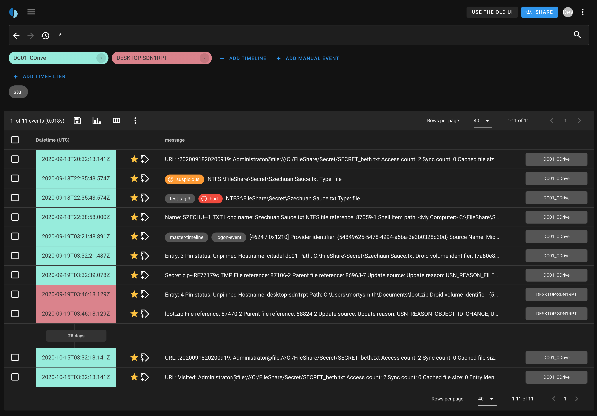

---
hide:
  - navigation
  - toc
  - title
  - footer
---

<h1 style="color:#fff; font-size:3em;font-weight:bold;margin-bottom:-5px;margin-top:50px;">Collaborative timeline analysis</h1>
<h2 style="max-width:70%;margin-bottom:30px;">Timesketch is an open-source tool for collaborative forensic timeline analysis. Using sketches you and your collaborators can organize and work together.</h2>

[Get Started](/guides/getting-started/){ .md-button .md-button--primary }

 
<!--

-->

<small>
**Obligatory Fine Print**: This is not an official Google product (experimental or otherwise), it is just code that happens to be owned by Google.
</small>

